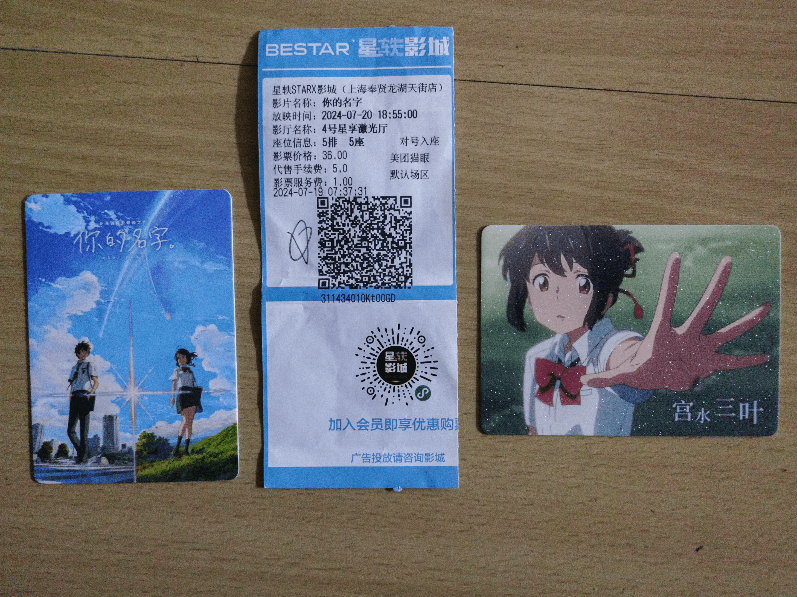

​	前天《你的名字》重映，昨天跟好哥们S一块去看的

<!-- more -->

​	快开场的时候他左边又来了一个小姑娘，年龄貌似比我们小了得有6、7岁，看得出来很局促，不知道她怎么想的，但我很想对她保证，我俩绝对是铁哥们，不是什么🌈。

​	这部电影我之前看过很多遍了，当初被关在小黑屋里面的时候为数不多能看的下去的电影，最开始几遍是看剧情和细节，后面几遍就纯粹是听里面的配乐（这个真的很好听），S说这配乐是不是重新做的，云啊，纯云😭。

​	还是熟悉的剧情，熟悉到有很多台词都能背下来，当初在那台做听说的电脑前反复观看的感觉蹭蹭蹭地一下又回来了。大学前看&&大学毕业看，也算是贯穿了人生最开心的四年时光，不由得感叹时间过得是真的快，第一回看的时候本身也是和男女主差不多的年龄，那时也会幻想这种事发生在自己身上会怎么样；但这一次再看的时候内心确实对过去的回忆和渴望再来的念头，一想到这样热烈的学生时光在我身上已经结束了，不免会感到一阵低落，我也不知道那到底是什么样的情绪，是怀念吗，是后悔吗？

​	不知不觉间就染上了班味，彻底沦落成了一名打工社畜。不知道还要多久才能适应这样的生活节奏。与其说是适应，麻木会不会更合适一些，麻木、冷漠，直到变成自己曾经最讨厌的章鱼哥的模样。

————分割线————

电影结束去拿周边，又碰上之前那个小姑娘了，看到我们，感觉她快碎掉了，拿完东西拔腿就跑，目测年龄看着像是初三到高中的样子，我其实打心底希望他/她们这个年龄段的人能好好地珍惜这段时光。

说实话，新海诚之后的作品我都有看，但是很难吊起我这么强烈的情绪反馈了。故事的人物始终保持着他们的青春，可我的青春已经像风一样飘散了，我逐渐对主角们的奔跑失去兴趣，更不用说和主角们产生情感上的共鸣，即便是这次的重映，之所以能引起我的情绪波动，也不过是因为它十分难得地让我想起了自己曾经的时光，那段自由热烈，对未来憧憬着渴望的青春。

最后分享一点我拿的周边吧。

 

奉贤龙湖的星轶影院只给了我三叶的特典卡，后来发现少了一张，实在是不甘心，去咸鱼花了10.9元又淘了一张泷的特典卡，后面到货了我再把照片补上