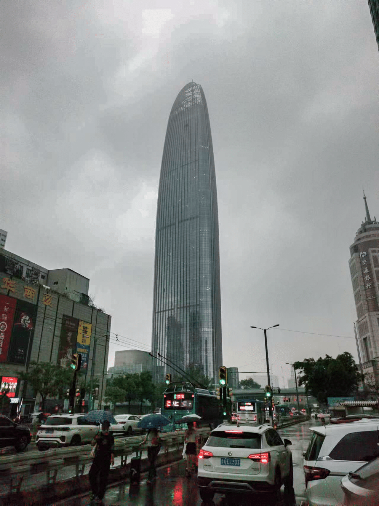
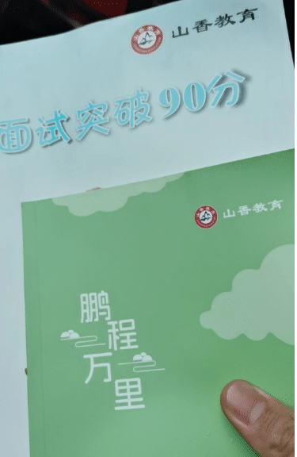
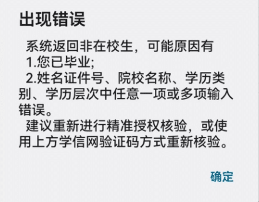

​	2024年6月21日，独自前往山东进行游玩，济南市停留了一天半时间游玩。

<!-- more -->

> * Created by Typora
> * Author: LRay-iu
> * createTime: 2024-06-28 10:48
> * updateTime: 2024-06-28 10:48

## 行程记录

```txt
6月21日：小雨转暴雨
05：40 驱车前往上海虹桥火车站
07：38 乘坐G110次列车前往济南西站
11：40 到达济南西站，买了两张刮刮乐，一张没中
12：35 乘坐G6999次列车前往济南站
13：00 前往酒店，放下行李，前往最近的一个超意兴吃饭
15：00 步行前往大观园
16：00 抵达趵突泉
19：00 返回酒店
19：40 骑自行车前往千佛山
21：15 打车返回酒店

6月22日：晴
08：30 出发前往济南站办理行李寄存，加一顿早饭
08：52 乘坐K3次公交车，在共青团路站下车，骑车前往五龙潭公园 
11：30 骑车前往芙蓉街
12：30 穿过芙蓉街来到曲水亭街
12：55 穿过曲水亭街来到大明湖
13：00 沿着大明湖步行游览
14：00 进入超然楼进行观光
16：45 骑车前往宽厚里
17：15 从宽厚里步行前往黑虎泉
18：00 骑车返回曲水亭街
18：40 骑车前往超然楼
19：30 骑车前往济南站

```

## 大观园

​	阿油给我的酒店定在槐荫区经三路省立医院附近地希岸酒店，个人还是很满意这家酒店的，不论是卫生还是配套设施；

​	因为下雨，我刚开始的计划是步行前往大观园，结束之后直接返回酒店休息的

​	步行路上正好路过了网红打卡点，有不少人在此处拍照，老城区的一些城市文化做的还是很可以的


<br>


<br>


​	计划赶不上变化，大观园显然是被自媒体捧过头了😂

​	小吃街规模不算很大，能逛的区域不算很多，个人觉得不算很惊艳，不过里面有一些非物质文化的小店，包括相声，泥砖等等


## 趵突泉

​	向东一路步行过去，走到了济南绿地普利中心，运气不太妙啊，到这的时候突然下起了暴雨



​	一阵暴雨过后，前往趵突泉的路上走错了地方，误入了一个小胡同里，遇到一个阿姨，帮我指明了前往趵突泉的途径，然后塞给了我一本小册子（果然是考公考编大省）



​	趵突泉这个景点凭借全日制学生证，在当地的一个app-----369出行上绑定学信网信息之后会生成一个通过码，免费参观趵突泉，不过学校在这个节骨眼提前给我的学信网提交了毕业信息，导致这个认证并没有通过，最后还是购买的学生票，这个只看学生证信息，比较宽松，20r一张



​	济南之所以叫泉城，不是因为这里有号称天下第一趵突泉，而是因为这里有着一个较大范围的泉群，包括一些小胡同的命名也是根据小胡同里的泉名来的。

​	所谓的趵突泉其实是一个三眼泉，我刚到的时候正在下雨，泉水的翻腾并不是很明显，看过去就像是小泡泡升起一样。


​	值得一提的是，不仅是这一片泉水池，几乎园区里能观察到的泉水池几乎都有这个特性，水池清澈见底，观赏的鱼也是肥美华丽，鱼和水之间虽然达不到皆若空游无所依的地步，但也能轻松的望见鱼的游耍以及池底的植被。这一方面是因为泉水本身的水质足够好，另一方面也是因为园区对泉群的管理到位，几乎每一个有泉池的地方都能听见广播在播放禁止游客投喂米油，馒头，面包之类的话语。

​	在这片园区之中，还有一些纪念馆，包括李清照纪念馆以及五三惨案纪念馆等等


> 济南惨案，又称五三惨案。1928年2月，蒋、桂、冯、阎联合发动了与张作霖争夺东北的战争。1928年4月，蒋介石军队北进。为阻止英、美势力向北发展，1928年5月3日，日本侵略者在山东省济南向国民党军发动进攻。由于蒋介石一味妥协退让并下达不抵抗命令，大量中国军民遭到屠杀。当国民革命军进占济南时，日本帝国主义借口保护日侨，出兵干涉，并于1928年5月3日凶残地杀害了国民政府山东特派交涉员蔡公时等17名外交人员，进而强占全城，恣意杀戮中国军民6123人，激起全中国人民的极大愤慨，同时也受到世界舆论的谴责。美、英等国从他们在华利益出发，也向日本施加压力。1929年2月28日，日本政府与国民党政府达成协定，并从济南撤军，济南事件即告结束。

出于对不幸遇难的那些亡者的敬意，五三惨案纪念馆以及纪念碑都没有拍摄照片。不过，在纪念馆中存放着济南城墙的原貌修复模型。


- [x] 购置相机
- [ ] 备考软考
- [ ] 带着妈妈看日出金山
