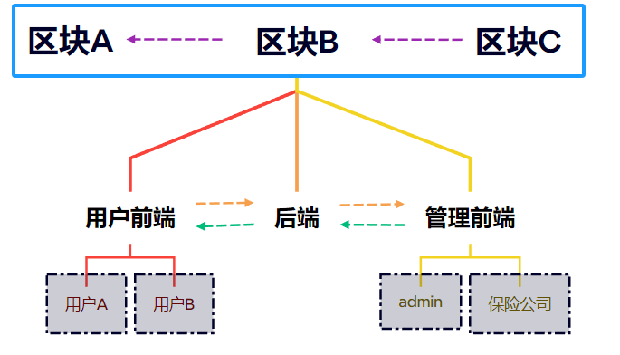
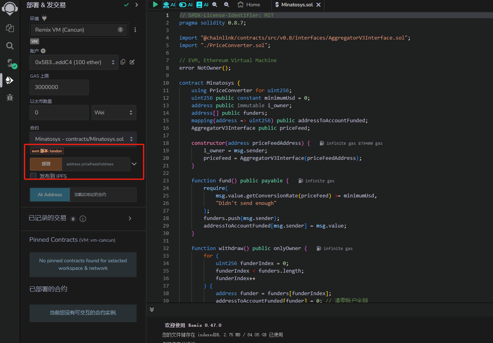

​	该文档为水门车险的区块链部分，记录了水门车险在区块链这个模块的开发以及部署过程，语言方面使用了Solidity。语法接近js，上手较为容易。合约的部署则介绍了两种方式，Remix以及Hardhat。

<!-- more -->

>  * Created by Typora
>  * Author: LRay-iu
>  * createTime: 2024-03-09 14:12
>  * updateTime: 2024-05-06 16:10

## 前言

这个文档记录了**水门车险区块链模块**的开发过程。

内容是基于区块链技术开发的一个车险系统，关于区块链的的概念详见其他markdown；

这个系统并没有往实际使用的方向开发，纯粹是应付毕业设计所准备的，因此可能存在很多不合理的设计或者是奇奇怪怪的bugs，总之，一切努力只为能够通过毕设考核。

整个项目暂定分成三个模块，前端、后端、区块链。

```terminal
D:.
├─gin-minato
├─hardhat-minato
└─vue-minato
```

- 架构设计



go ~ go ~ go！

## 工具包

Remix网址：https://remix.ethereum.org/

测试币水龙头：https://faucets.chain.link

Sepolia区块链浏览器：https://sepolia.etherscan.io/

Chainlink官方文档：https://docs.chain.link

以太坊货币换算：https://eth-converter.com/

Solidity 使用文档：https://solidity-by-example.org

## 区块链

### 合约

```solidity
// SPDX-License-Identifier: MIT
pragma solidity 0.8.7;

import "@chainlink/contracts/src/v0.8/interfaces/AggregatorV3Interface.sol";
import "./PriceConverter.sol";

// EVM, Ethereum Virtual Machine
error NotOwner();

contract Minatosys {
    using PriceConverter for uint256;
    uint256 constant minimumUsd = 0;
    address public immutable i_owner;
    AggregatorV3Interface public priceFeed;

    constructor(address priceFeedAddress) {//构造，合约部署时需要向它传入以下参数
        i_owner = msg.sender;
        priceFeed = AggregatorV3Interface(priceFeedAddress);
    }

    function fund() public payable {//资金注入方法
        require(
            msg.value.getConversionRate(priceFeed) > 0,//判断金额是否大于0，否则会回滚交易
            "Didn't send enough"
        );
    }

    function withdraw() public onlyOwner {
        (bool callSuccess, ) = payable(msg.sender).call{//提取资金，非合约部署账户不能调用这个方法
            value: address(this).balance
        }("");
        require(callSuccess, "call failed");
    }

    // 管理员转账
    function withdrawToAddress(
        address payable _to,
        uint256 _amount
    ) public onlyOwner {//提取资金，非合约部署账户不能调用这个方法
        // 检查目标地址是否有效
        require(_to != address(0), "Invalid address");
        // 检查合约余额是否足够支付转账金额
        require(address(this).balance >= _amount, "Insufficient balance");
        // 使用 call 方法向目标地址发送以太币
        // 设置发送者为合约的所有者
        (bool callSuccess, ) = _to.call{value: _amount}("");
        // 检查调用是否成功
        require(callSuccess, "Call failed");
    }

    // 莫名其妙地收到钱就执行下面两个方法
    receive() external payable {
        fund();
    }

    fallback() external payable {
        fund();
    }

    // 自定义修饰符，带上这个标签的方法将只对合约发布者开放使用权限
    modifier onlyOwner() {
        require(
            msg.sender == address(0) || msg.sender == i_owner,
            "Sender is not owner"
        );
        _;
    }
}

```

库：

```solidity
//SPDX-License-Identifier: MIT
pragma solidity 0.8.7;
import "@chainlink/contracts/src/v0.8/interfaces/AggregatorV3Interface.sol";

library PriceConverter {
    function getPrice(
        AggregatorV3Interface priceFeed
    ) internal view returns (uint256) {
        //得到汇率(USD/ETH)
        //ABIw
        //Address 0x694AA1769357215DE4FAC081bf1f309aDC325306
        // AggregatorV3Interface priceFeed = AggregatorV3Interface(
        //     0x694AA1769357215DE4FAC081bf1f309aDC325306
        // );
        (, int256 answer, , , ) = priceFeed.latestRoundData();

        return uint256(answer * 1e10);
    }

    function getVersion() internal view returns (uint256) {
        //获取了链外数据源的版本信息，并将其作为uint256类型返回
        AggregatorV3Interface priceFeed = AggregatorV3Interface(
            0x694AA1769357215DE4FAC081bf1f309aDC325306
        );
        return priceFeed.version();
    }

    function getConversionRate(
        uint256 ethAmount,
        AggregatorV3Interface priceFeed
    ) internal view returns (uint256) {
        uint256 ethPrice = getPrice(priceFeed);
        uint256 ethAmountInUsd = (ethPrice * ethAmount) / 1e18;
        return ethAmountInUsd;
    }
}

```

具体写法以及solidity的语法可以参考《Patrick Collins-区块链学习笔记》

### 部署

#### Remix

有两种部署方法，这边强力推荐使用**Remix**，真的很方便，合约输进去可以直接部署，非常适合需求不高的合约部署，唯一缺点就是网速似乎不太理想，经常链接钱包和测试网连接不上。

如果使用Remix的话，基本上到此就结束了😂输入喂价地址之后，直接deploy就行，喂价地址可以从Chainlink那里获取，此处可以试着使用Sepolia的喂价地址：`0x694AA1769357215DE4FAC081bf1f309aDC325306(这个不保真，可能会更新换代，还是建议自己去官网获取)`

*值得一提的是，Patrick Collins是他们的开发者大使，被请来录制的课程并且被Chainlink_cn翻译成中文放在B站上供大家学习，内容还是很新鲜且经常更新的，值得初学者去观看。另外，他们在Github上还有一个社区，可以供大家提问，虽然我问了但是没有得到解答，不过问题不大，有总比没有强😭*



本项目使用了第二种方式，如下：

#### Hardhat

Hardhat是一个轻量级的合约部署框架，优点是可以安装自己需要的插件，这对于高级开发来说是非常使用的，包括prettier这样的代码格式化插件等等；并且可以自行编写脚本，包括部署脚本以及测试脚本等等等等

但是Hardhat貌似？更新起来，文档有时会跟不上，这会导致对于新手来说，可能看文档并不会有很好的体验，【差点把我折磨疯了】，

即便是2年内录制的课程，实际操作时也会有所不同。因此，如果你是一名想用区块链来完成毕业设计之类的项目，强力推荐Remix。

Hardhat部署所需的插件以及搭建过程这里不做赘述，详情请见《Patrick Collins-区块链 笔记》，这里只简单说明部署过程以及合约内容

```txt
---
  |-- artifacts			#编译结果保存，包括ABI等等
  |-- cache				#Hardhat框架生成的缓存文件
  |-- contracts			#合约以及喂价合约等等
  |-- deploy			#部署合约的脚本
  |-- deployments		#已经部署的合约的相关数据，比如部署时产生的地址、交易哈希等信息
  |-- ignition			#Hardhat框架的一些配置文件或模板文件
  |-- node_modules		#依赖
  |-- test				#测试文件夹，包含一些测试脚本
  |-- utils				#辅助开发的工具函数或辅助脚本文件，比如verify.js等等
  |-- package.json		#依赖管理
  |-- hardhat.config.js	#框架配置文件
  |-- helper-hardhat-config.js	#辅助框架配置文件
  |-- yarn.lock
  \-- README.md

9 directories, 5 files

```

框架配置信息`hardhat.config.js`，包括编译器版本，账户私钥等等信息

```javascript
require("@nomicfoundation/hardhat-toolbox");
require("hardhat-deploy");
require("dotenv").config();
require("hardhat-gas-reporter");
/** @type import('hardhat/config').HardhatUserConfig */
const SEPOLIA_RPC_URL = process.env.SEPOLIA_RPC_URL;
const PRIVATE_KEY = process.env.PRIVATE_KEY;
const ETHERSCAN_API_KEY = process.env.ETHERSCAN_API_KEY;

module.exports = {
  solidity: {
    compilers: [
      {
        version: "0.8.7",
      },
      {
        version: "0.6.6",
      },
    ],
  },
  defaultNetwork: "hardhat",
  networks: {
    hardhat: {
      chainId: 31337,
      // gasPrice: 130000000000,
    },
    sepolia: {
      url: SEPOLIA_RPC_URL,
      accounts: [PRIVATE_KEY],
      chainId: 11155111,
      blockConfirmations: 6,
    },
  },
  gasReporter: {
    enabled: true,
    currency: "USD",
    outputFile: "gas-report.txt",
    noColors: true,
    // coinmarketcap: COINMARKETCAP_API_KEY,
  },
  etherscan: {
    apiKey: ETHERSCAN_API_KEY,
  },
  namedAccounts: {
    deployer: {
      default: 0, // here this will by default take the first account as deployer
      1: 0, // similarly on mainnet it will take the first account as deployer. Note though that depending on how hardhat network are configured, the account 0 on one network can be different than on another
    },
  },
  mocha: {
    timeout: 500000,
  },
};
```

##### 本地网

也就是`Hardhat`自带的本地网络，优点是，测试币很多，可以随意霍霍，交易速度非常快而且不容易出岔子

但是，本地网络是无法获取喂价合约的，换句话说Chainlink预言机在这方面并不能给予你帮助，因此，在部署之前，我们需要先部署一个虚拟的喂价合约，这里并不完全需要自己去写，在`chainlink`的`github`中仔细翻找可以找到`node_modules\@chainlink\contracts\src\v0.6\tests\MockV3Aggregator.sol`，因此，我们可以在喂价合约中直接引入，效果等同于复制粘贴；

```solidity
//SPDX-License-Identifier:MIT
pragma solidity ^0.6.0;

import "@chainlink/contracts/src/v0.6/tests/MockV3Aggregator.sol";

```

之后我们就可以开始着手准备部署合约的脚本了；

首先，我们需要处理喂价合约以及合约的chainID，也就是用于判断合约被部署在了哪条链上

```javascript
//helper-hardhat-config.js
const networkConfig = {
    31337: {
        name: "localhost",
    },
    // Price Feed Address, values can be obtained at https://docs.chain.link/data-feeds/price-feeds/addresses
    11155111: {
        name: "sepolia",
        ethUsdPriceFeed: "0x694AA1769357215DE4FAC081bf1f309aDC325306",
    },
}

const developmentChains = ["hardhat", "localhost"]

module.exports = {
    networkConfig,
    developmentChains,
}

```

先将我们自己编写的喂价合约发布到`Hardhat`链上,这样我们部署的合约就可以通过本地链上的喂价合约得到USD/ETH的汇率
这里脚本做了一个判断，如果`chainID`为`31337`，也就是处于开发链上时，会对合约进行部署

```javascript
//00-deploy-mocks.js
//这段是部署本地预言机
const { network } = require("hardhat");

const DECIMALS = "8";
const INITIAL_PRICE = "200000000000"; // 2000

module.exports = async ({ getNamedAccounts, deployments }) => {
  const { deploy, log } = deployments;
  const { deployer } = await getNamedAccounts();
  const chainId = network.config.chainId;
  log(network.name);
  if (chainId == 31337) {
    log("Local network detected!Deploying mocks...");
    await deploy("MockV3Aggregator", {
      contract: "MockV3Aggregator",
      from: deployer,
      log: true,
      args: [DECIMALS, INITIAL_PRICE],
    });
    log("Mocks deployed!");
    log("--------------------------------------------------------");
  }
};
// 这段代码指定了当前部署脚本相关的标签。在这里，使用了两个标签："all" 和 "mocks"。
// "all" 标签： 这个标签可能用于将部署脚本与整个项目的所有部署任务关联起来。
// 当运行 npx hardhat deploy --tags all 时，将运行所有带有 "all" 标签的部署任务。
// "mocks" 标签： 这个标签可能用于将部署脚本与与模拟合约相关的其他部署任务关联起来。
// 当运行 npx hardhat deploy --tags mocks 时，将运行所有带有 "mocks" 标签的部署任务。
//yarn hardhat deploy --tags mocks
module.exports.tags = ["all", "mocks"];
```

接着，我们需要部署**水门车险**的合约，这里是第二个脚本

脚本对预言机的选择上会进行一个判断，如果是在开发链，也就是本地链上，则会使用开发链上部署的喂价合约`MockV3Aggregator`，反之就会根据chainID，从`networkConfig[chainId]["ethUsdPriceFeed"]`获取喂价地址；

另外，如果是在非开发链上，并且以太坊API KEY被正确配置时，会触发对合约的验证。

```javascript
//01-deploy-fund-me.js
const {
    networkConfig,
    developmentChains,
} = require("../helper-hardhat-config.js")
const { network } = require("hardhat")
const { verify } = require("../utils/verify.js")

//hre代表hardhat运行环境
// module.exports = async (hre) => {
//     const {getNameAccounts,deployments} = hre
// }
//node.js的语法糖，写法等同于上方的
module.exports = async ({ getNamedAccounts, deployments }) => {
    //将deploy和log从deployments这个对象中提取出来，等同于
    //const deploy = deployments.deploy;
    //const log = deployments.log
    const { deploy, log } = deployments
    //getNameAccounts() 返回一个包含 deployer 属性的对象，等同于
    //const getNameAccountsResult = await getNameAccounts();
    //const deployer = getNameAccountsResult.deployer;
    log("Deploy Minatosys...")
    const { deployer } = await getNamedAccounts()
    const chainId = network.config.chainId

    //---------------确认预言机地址-----------------
    if (developmentChains.includes(network.name)) {
        const ethUsdAggregator = await deployments.get("MockV3Aggregator")
        ethUsdPriceFeedAddress = ethUsdAggregator.address
    } else {
        // ethUsdPriceFeedAddress的格式：0x694AA1769357215DE4FAC081bf1f309aDC325306
        ethUsdPriceFeedAddress = networkConfig[chainId]["ethUsdPriceFeed"]
    }

    // log(ethUsdPriceFeedAddress);
    //-----------------deploy-----------------------
    const args = [ethUsdPriceFeedAddress]
    const Minatosys = await deploy("Minatosys", {
        from: deployer,
        args: args, //喂价地址
        log: true,
        waitConfirmation: network.config.blockConfirmations || 1,
    })
    //-------------------verify-----------------------
    //当合约部署网络与指定的不符时会进行检查
    if (
        !developmentChains.includes(network.name) &&
        process.env.ETHERSCAN_API_KEY
    ) {
        //verify
        await verify(Minatosys.address, args)
    }
    log("--------------------------------------------------------")
}

module.exports.tags = ["all", "minatosys"]

```

命令行进行本地链部署：

```terminal
PS D:\study_test\Minato_Sys\hardhat-Minato> yarn hardhat deploy --network hardhat
yarn run v1.22.21
warning package.json: No license field
$ D:\study_test\Minato_Sys\hardhat-Minato\node_modules\.bin\hardhat deploy --network hardhat
Compiled 1 Solidity file successfully (evm target: london).
hardhat
Local network detected!Deploying mocks...
deploying "MockV3Aggregator" (tx: 0x3d732abdeda8235691578f5eae48ec57c18e6860c18196ab7b211ca8f74dce2b)...: deployed at 0x5FbDB2315678afecb367f032d93F642f64180aa3 with 569759 gas
Mocks deployed!
--------------------------------------------------------
Deploy Minatosys...
deploying "Minatosys" (tx: 0x1756b51c675657ec993c19959606c37e39b7ef407cfa1e84177b93f0e4449881)...: deployed at 0xe7f1725E7734CE288F8367e1Bb143E90bb3F0512 with 839016 gas
--------------------------------------------------------
Done in 8.47s.
```

##### 测试网

测试网的部署不需要手动配置Mock合约，我们可以直接通过喂价地址获得合约

但是完成在测试网的部署之后，我们需要编写一个验证脚本，用以检查被部署的合约与我们想部署的合约是否一致，避免发生被篡改的事件。

这里`Hardhat`框架有为我们提供验证方法，直接调用即可

`verify:verify` 是 Hardhat 框架中的一个任务（task），它用于执行智能合约的验证过程。具体来说，这个任务会将智能合约的源代码和部署信息提交给以太坊的验证服务（如 Etherscan 或其他类似的服务）。验证服务将检查合约的源代码是否与已部署的合约匹配，以及是否包含了正确的构造函数参数。

*//以上说法来自chatgpt，但是验证部分我记得有些不太清楚了，具体`Hardhat`是怎么完成的，我确认好之后会进行修改；*

```javascript
//verify.js
const { run } = require("hardhat");
const verify = async (contractAddress, args) => {
  console.log("Verifying Contract...");
  try {
    await run("verify:verify", {
      address: contractAddress,
      constructorArguments: args,
    });
  } catch (e) {
    if (e.message.toLowerCase().includes("already verified")) {
      console.log("Already Verified!");
    } else {
      console.log(e);
    }
  }
};
module.exports = { verify };

```

命令行进行测试网部署（以Sepolia为例）：

```terminal
PS D:\study_test\Minato_Sys\hardhat-Minato> yarn hardhat deploy --network sepolia
yarn run v1.22.21
warning package.json: No license field
$ D:\study_test\Minato_Sys\hardhat-Minato\node_modules\.bin\hardhat deploy --network sepolia
Compiled 1 Solidity file successfully (evm target: london).
sepolia
Deploy Minatosys...
deploying "Minatosys" (tx: 0x5eeadc93ad11de1fc2cec56c48aa77eb2d3775cfa2a8769cc38cd75c783f6246)...: deployed at 0x03cDbE6020084eb013b02B8d8e0A90BE018fb39E with 806890 gas
Verifying Contract...
UnexpectedError: An unexpected error occurred during the verification process.
Please report this issue to the Hardhat team.
Error Details: Connect Timeout Error
    at Etherscan.isVerified (D:\study_test\Minato_Sys\hardhat-Minato\node_modules\@nomicfoundation\hardhat-verify\src\internal\etherscan.ts:126:13)
    at processTicksAndRejections (node:internal/process/task_queues:95:5)
    at SimpleTaskDefinition.action (D:\study_test\Minato_Sys\hardhat-Minato\node_modules\@nomicfoundation\hardhat-verify\src\internal\tasks\etherscan.ts:101:24)
    at Environment._runTaskDefinition (D:\study_test\Minato_Sys\hardhat-Minato\node_modules\hardhat\src\internal\core\runtime-environment.ts:359:14)
    at Environment.run (D:\study_test\Minato_Sys\hardhat-Minato\node_modules\hardhat\src\internal\core\runtime-environment.ts:192:14)
    at SimpleTaskDefinition.action (D:\study_test\Minato_Sys\hardhat-Minato\node_modules\@nomicfoundation\hardhat-verify\src\index.ts:284:9)
    at Environment._runTaskDefinition (D:\study_test\Minato_Sys\hardhat-Minato\node_modules\hardhat\src\internal\core\runtime-environment.ts:359:14)
    at Environment.run (D:\study_test\Minato_Sys\hardhat-Minato\node_modules\hardhat\src\internal\core\runtime-environment.ts:192:14)
    at verify (D:\study_test\Minato_Sys\hardhat-Minato\utils\verify.js:6:5)
    at Object.module.exports [as func] (D:\study_test\Minato_Sys\hardhat-Minato\deploy\01-deploy.js:61:7)
--------------------------------------------------------
Done in 85.66s.
```

### 小结

至此，水门车险的合约部分就被部署完成了，个人还是很推荐使用Remix的部署方式，当然，如果你有意向深入学习使用智能合约，那Hardhat这样的框架也是非常有学习的价值


