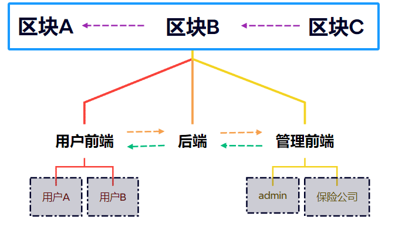
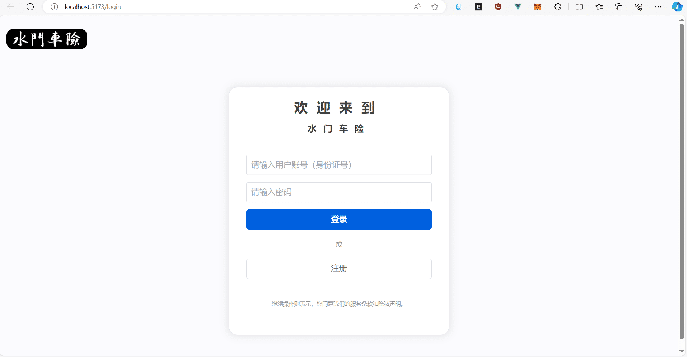
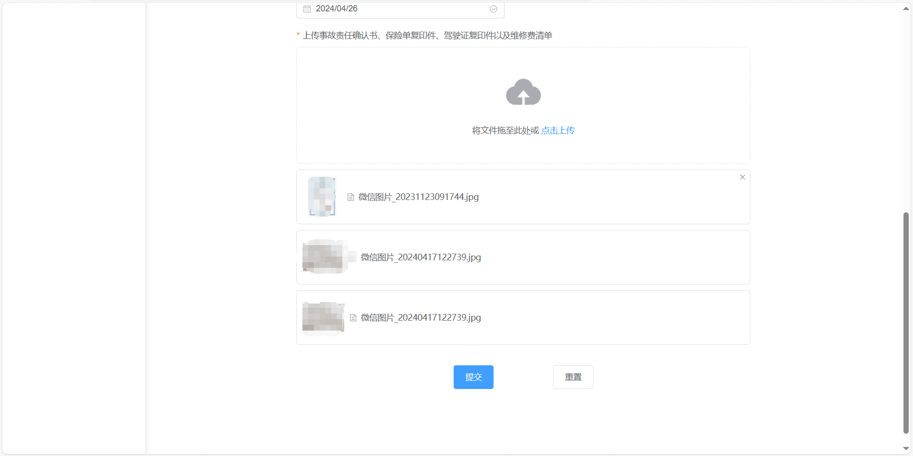
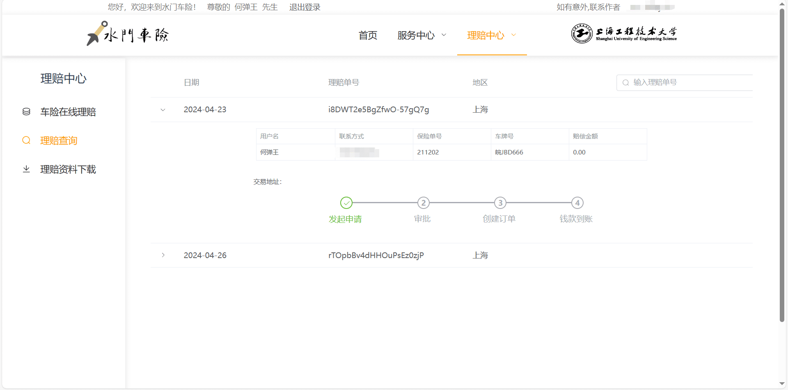

该文档为水门车险的前端部分，记录了水门车险在前端这个模块的开发过程，组件库方面选择了 ElementPLUS，这个组件库在官网有着非常详细的文档，非常适合前端不熟悉的人用其制作精美的页面；

<!-- more -->

> - Created by Typora
> - Author: LRay-iu
> - createTime: 2024-04-25 14:00
> - updateTime: 2024-05-06 16:08

## 前言

这个文档记录了**水门车险前端模块**开发过程中的部分功能实现方法。

内容是基于区块链技术开发的一个车险系统，关于区块链的的概念详见其他 Markdown；

这个系统并没有往实际使用的方向开发，纯粹是应付毕业设计所准备的，因此可能存在很多不合理的设计或者是奇奇怪怪的 bug，总之，一切努力只为能够通过毕设考核。

整个项目暂定分成三个模块，前端、后端、区块链。

```terminal
D:.
├─gin-minato
├─hardhat-minato
└─vue-minato
```

- 架构设计



go ~ go ~ go！

## 准备工作

需要安装`node.js`

```terminal
PS D:\study_test\Minato_Sys\vue-Minato> node --version
v18.18.0
```

#### 安装和部署

```terminal
# 选择一个你喜欢的包管理器
# 安装element-plus
# NPM
$ npm install element-plus --save
# Yarn
$ yarn add element-plus
# pnpm
$ pnpm install element-plus

# “自动导入”插件
$ npm install -D unplugin-vue-components unplugin-auto-import

# 安装setup语法糖插件
$ npm i vite-plugin-vue-setup-extend -D

# 安装icon图标库
$ npm install @element-plus/icons-vue

# 安装Metamask插件
$ npm i @metamask/detect-provider

# 安装axios
$ npm i axios

# 安装pinia
$ npm i pinia
```

使用 Element-plus 的方法请参考官方文档，写得非常详细，我觉得完全没必要多此一举再写一遍：https://element-plus.org/zh-CN

同时，您还需要准备一个`Metamask`钱包，用以对接接受支付和接受赔偿金的环节


## 页面设计

`src`下的目录大概像这样，其中经常复用的如侧边栏、顶栏、页脚被写进了`components`文件夹

_//很多页面的 UI 都是"**借鉴**"了各大网页的，包括了`Mozilla`、中国平安等等等等_

```terminal
|-- App.vue
|-- components
|   |-- ClaimSide.vue
|   |-- InsuranceSide.vue
|   |-- PageBotton.vue
|   `-- PageTop.vue
|-- interface
|   |-- claimForm.ts
|   `-- loginResult.ts
|-- main.ts
|-- pages
|   |-- HomePage.vue
|   |-- Login.vue
|   |-- Register.vue
|   |-- admin_Claim.vue
|   |-- admin_Claim_Detail.vue
|   |-- user_Claim.vue
|   |-- user_ClaimQuery.vue
|   |-- user_InsuranceBought.vue
|   `-- user_InsuranceQuery.vue
|-- router
|   `-- index.ts
|-- scripts
|   |-- Codecheck.ts
|   |-- Minatosys.ts
|   |-- chineseCities.ts
|   |-- claim_helper.ts
|   |-- constants.ts
|   `-- ethers-5.7.esm.min.js
|-- store
|   `-- loginStore.ts

```









## 理赔申报

用户需要填写表单并且上传文件

上传文件使用的是`ElementPlus`中的`el-upload`，这里上传的文件会直接以 POST 的方法传到 http://localhost:8080/update，后端需要对这个文件进行接收

```vue
<el-form-item
  label="上传事故责任确认书、保险单复印件、驾驶证复印件以及维修费清单"
  required
  prop="claimfile">
	<el-upload
		ref="uploadRef"
        class="upload-demo"
        drag action="http://localhost:8080/update"
      	multiple style="width: 50vw"
       	:auto-upload="false"
       	list-type="picture"
       :before-upload="beforeClaimfileUpload"
        @change="handleChange">
        	<el-icon class="el-icon--upload"><upload-filled /></el-icon>
            	<div class="el-upload__text">
                	将文件拖至此处或 <em>点击上传</em>
                </div>
    </el-upload>
</el-form-item>
```

后端接收文件，这里以`Gin`为例

```golang
func (f FileController) Updatefile(ctx *gin.Context) {
	file, err := ctx.FormFile("file")
	if err != nil {
		fmt.Sprintf("get form err: %s", err.Error())
		config.ReturnFalse(ctx, 3001, "接收文件失败")
	}
	// 保存文件到本地
	err = ctx.SaveUploadedFile(file, "uploads/"+file.Filename)
	if err != nil {
		fmt.Sprintf("upload file err: %s", err.Error())
		config.ReturnFalse(ctx, 3002, "保存文件失败")
	}
	config.ReturnSuccess(ctx, 200, "成功接受并保存文件！", file, 1) // 返回文件名
}
```

申报需要对用户提交的内容进行验证

这里我们尽量在前端将这些都完成，避免无用表单对后端造成压力

首先在 el-form 中添加规则

```vue
<el-form ref="claimFormRef" :rules="rules"></el-form>
```

接着引入数据类型，也可以在当前页面直接定义，不过因为这个和表单提交部分复用了，所以我单独写了一个接口，方便之后使用

```typescript
//引入ClaimForm的钩子
import { type ClaimForm } from "@/interface/claimForm";
```

定义响应式，初始化和接收数据

```typescript
// 初始化各项数据，其中insuranceid不论怎么写最终读取都是字符串格式
// 因此不必过多纠结，打包的时候将其转换成number类型即可
const claimForm = reactive<ClaimForm>({
  claimid: nanoid(),
  username: "",
  userid: "",
  callnumber: "",
  insuranceid: "",
  carid: "",
  region: "",
  date: "",
  claimfile: [""],
});
```

定义验证规则

```typescript
const rules = reactive<FormRules<ClaimForm>>({
  username: [
    { required: true, message: "请输入用户名！", trigger: "blur" },
    { min: 2, max: 10, message: "请输入真实用户名！", trigger: "blur" },
  ],
  userid: [
    { required: true, message: "请输入身份证号！", trigger: "blur" },
    { validator: checkID, trigger: "blur" },
  ],
  //以下验证规则省略，基本同上
  callnumber: [],
  carid: [],
  insuranceid: [],
  region: [],
  date: [],
  claimfile: [],
});
```

其中，身份证校验需要单独写一份正则表达式加以验证：

_//这部分来自网上，下方有链接_

```typescript
// 有关身份证校验码
// 原文链接：https://blog.csdn.net/Cavendixe/article/details/129581874
let checkProv = function (val: string) {
  var pattern = /^[1-9][0-9]/;
  var provs: { [key: string]: string } = {
    11: "北京",
    12: "天津",
    13: "河北",
    14: "山西",
    15: "内蒙古",
    21: "辽宁",
    22: "吉林",
    23: "黑龙江",
    31: "上海",
    32: "江苏",
    33: "浙江",
    34: "安徽",
    35: "福建",
    36: "江西",
    37: "山东",
    41: "河南",
    42: "湖北",
    43: "湖南",
    44: "广东",
    45: "广西",
    46: "海南",
    50: "重庆",
    51: "四川",
    52: "贵州",
    53: "云南",
    54: "西藏",
    61: "陕西",
    62: "甘肃",
    63: "青海",
    64: "宁夏",
    65: "新疆",
    71: "台湾",
    81: "香港",
    82: "澳门",
  };
  if (pattern.test(val)) {
    if (provs[val]) {
      return true;
    }
  }
  return false;
};
let checkDate = function (val: string) {
  var pattern =
    /^(18|19|20)\d{2}((0[1-9])|(1[0-2]))(([0-2][1-9])|10|20|30|31)$/;
  if (pattern.test(val)) {
    var year = val.substring(0, 4);
    var month = val.substring(4, 6);
    var date = val.substring(6, 8);
    var date2 = new Date(year + "-" + month + "-" + date);
    if (date2 && date2.getMonth() == parseInt(month) - 1) {
      return true;
    }
  }
  return false;
};
let checkCode = function (val: any) {
  var p =
    /^[1-9]\d{5}(18|19|20)\d{2}((0[1-9])|(1[0-2]))(([0-2][1-9])|10|20|30|31)\d{3}[0-9Xx]$/;
  var factor = [7, 9, 10, 5, 8, 4, 2, 1, 6, 3, 7, 9, 10, 5, 8, 4, 2];
  var parity = [1, 0, "X", 9, 8, 7, 6, 5, 4, 3, 2];
  var code = val.substring(17);
  if (p.test(val)) {
    var sum = 0;
    for (var i = 0; i < 17; i++) {
      sum += val[i] * factor[i];
    }
    if (parity[sum % 11] == code.toUpperCase()) {
      return true;
    } else {
      console.log(parity[sum % 11]);
      return false;
    }
  }
  return false;
};

export let checkID = function (rule: any, value: any, callback: any) {
  if (checkCode(value)) {
    var date = value.substring(6, 14);
    if (checkDate(date)) {
      if (checkProv(value.substring(0, 2))) {
        callback();
      }
    }
  } else {
    callback(new Error("请输入合法身份证号"));
    // console.log(value)
  }
};
```

同时，我们还需要在提交表单前，手动确认表单，也就是在点击提交按钮后执行一次表单验证

```typescript
const formcheck = async (
  formEl: FormInstance | undefined
): Promise<boolean> => {
  if (!formEl) return false;
  try {
    await formEl.validate();
    console.log("submit!");
    return Promise.resolve(true);
  } catch (error) {
    console.log("error submit!", error);
    return Promise.reject(false);
  }
};
const combinedClick = async () => {
  //这里先经过表单验证，通过后会像后端开始发送json报文
  const isValid = await formcheck(claimFormRef.value);
  if (isValid) {
    //通过表单验证之后执行下方的方法
    submitClaimForm();
    submitUpload();
  } else {
    return;
  }
};
```

提交表单

```typescript
async function submitClaimForm() {
  //打包表单内容
  let claimMessage = {
    claim_id: claimForm.claimid,
    claim_user: claimForm.userid,
    claim_insurance: parseInt(claimForm.insuranceid),
    callnumber: claimForm.callnumber,
    car_id: claimForm.carid,
    region: claimForm.region,
    createtime: claimForm.date,
    // claim_file: claimForm.claimfile,
  };
  // console.log("提交表单内容为", claimMessage)
  try {
    const response = await axios.post(
      "http://localhost:8080/addclaim",
      claimMessage
    );
    // console.log("send successful:", response.data.data)
    switch (response.data.code) {
      case 200:
        ElMessage({
          message: "申报成功！",
          type: "success",
        });
        //3秒后跳转至理赔查询
        setTimeout(() => {
          router.push("/3-2");
        }, 300);
        // 可以添加其他情况的处理
        break;
      //其他提交失败的结果
      case 2001:
      default:
    }
  } catch (error) {
    console.error("Claim failed:", error);
    // 申报失败的处理
  }
}
```

但是，el-update 提交的表单不能修改文件名，始终会显示变量只读，我也不知道怎么修改

所以我换了一个思路，在前端拿到文件的时候，将文件名存储在一个数组中，同时记录对应的申报 id，也就是`claimid`，将这些内容打包发送至后端，由后端接受并对保存的文件进行改名。

```typescript
//上传前会对文件进行检查，只允许jpg格式的文件上传至后端
const beforeClaimfileUpload: UploadProps["beforeUpload"] = (rawFile) => {
  if (rawFile.type !== "image/jpeg") {
    ElMessage.error("图片仅支持jpeg格式");
    return false;
  } else if (rawFile.size / 1024 / 1024 > 5) {
    ElMessage.error("图片不能超过5MB!");
    return false;
  }
  return true;
};
// 监听上传组件的 change 事件，只要一有文件被加进来就会触发
//目的是为了获取上传的文件名并就将其保存在claimForm.claimfile[]这个数组中
const handleChange = (file: any, fileList: any) => {
  // 获取第一个文件的文件名
  if (fileList.length > 0) {
    for (let i = 0; i < fileList.length; i++) {
      //fileList.name这个属性是只读的，没办法修改，很叫人头疼
      claimForm.claimfile[i] = fileList[i].name;
      // console.log("上传文件为", claimForm.claimfile[i])
    }
  } else {
    claimForm.claimfile[0] = "";
  }
};

//功能是对提交表单的补充，目的是上传文件并将上传的文件名，绑定的申报单号发送至后端
const submitUpload = () => {
  uploadRef.value!.submit();
  let fileMessage = {
    filename: claimForm.claimfile,
    file_according: claimForm.claimid,
    createtime: claimForm.date,
  };
  // console.log("修改表单内容为", fileMessage)
  //延迟提交，这个补充的改名接口必须等到图片以及被保存之后再执行，否则可能会出现图片还没保存，改名指令已经提交过来了，后端会因为找不到文件名而改名失败。
  //这实在不是一个很好地办法，最好的办法还是能够在前端就对文件进行改名
  setTimeout(async () => {
    await axios.post("http://localhost:8080/updatesupport", fileMessage);
  }, 200);
  // console.log("send successful:", response.data.data)
};
```

至此，用户申报部分就完成了，整个背后的流程分别是：

用户填写表单/存储表单文件名=>表单验证=>表单提交=>表单文件验证=>表单文件提交=>表单文件名数组+表单号提交

## 区块链交互

区块链的交易需要使用用户私钥，如果完全由我们执行的话，但是对于区块链而言，账户私钥基本上算是把钱包权限完全交出去了，不仅我们需要花费资源和精力妥善保管，一不小心可能还有被篡改的风险。

因此，在水门车险中我们使用`Metamask`来完成这一点，`Metamask`算是一个比较成熟的钱包，由它来负责保管用户的私钥。就好比我们使用支付宝进行支付一样，我们无需在商店门口一个一个输入自己的银行卡号和密码，只需要支付宝轻轻一扫。

但是在使用前我们需要在前端验证浏览器有没有安装`Metamask`插件，这里我们使用`ethers-5.7.esm.min.js`，可以自己下载也可以npm安装。但是具体使用方法要看版本号以及对应的文档。

```typescript
import { ethers } from "@/scripts/ethers-5.7.esm.min.js"
// 用以检查浏览器有没有安装Metamask扩展
async function connect() {
    if (typeof (window as any).ethereum !== "undefined") {
        await (window as any).ethereum.request({
            method: "eth_requestAccounts",
        })
    } else {
        console.log("No metamask!")
    }
}
```

接着我们需要实例化一个合约钱包，用以调用钱包中的方法，在那之前我们需要将合约的信息封装起来

```typescript
//constant.ts
//合约地址
export const contractAddress = "0x03cDbE6020084eb013b02B8d8e0A90BE018fb39E"
//合约编译生成的abi
export const abi = [
    {
        inputs: [
            {
                internalType: "address",
                name: "priceFeedAddress",
                type: "address",
            },
        ],
        stateMutability: "nonpayable",
        type: "constructor",
    },
]
```

接着实例化

```typescript
import { ethers } from "@/scripts/ethers-5.7.esm.min.js"
import { abi, contractAddress } from "./constants"
// 假设 1 人民币 = 39,583,333,333,333 wei
// 其实这里偷懒了，和合约那边的喂价合约没对应上，最好是传数字到合约中的方法，之后再通过喂价合约转换成wei
const RMB_TO_WEI_RATE = BigInt("39583333333333")
const provider = new ethers.providers.Web3Provider((window as any).ethereum)
const signer = provider.getSigner()
//创建智能合约实例
const contract = new ethers.Contract(contractAddress, abi, signer)
```

接着我们使用这个实例化后的钱包调用合约中的方法

```typescript
//Minatosys.ts
//管理员转账
import { updateAddress } from "./claim_helper"
async function compensation(
    toAddress: any,
    amountInCNY: number,
    claimid: string,
) {
    let amountInWei: BigInt = BigInt(amountInCNY) * RMB_TO_WEI_RATE
    console.log("Funding with", toAddress)
    if (typeof (window as any).ethereum !== "undefined") {
        // 这里需要严格对应上合约中的方法，注意方法需要的参数类型
        const tx = await contract.withdrawToAddress(
            toAddress,
            ethers.BigNumber.from(amountInWei),
        )
        await tx.wait()
        updateAddress(tx.hash, claimid)
        console.log("Transaction successful")
    } else {
        console.log("No metamask!")
    }
}
```

其中，关于引入的`updateAddress`

```typescript
//updateAddress.ts
//用以更新数据库中交易的地址
import axios from "axios"
export async function updateAddress(address: string, claimid: string) {
    let updateaddress = {
        claim_id: claimid,
        address: address,
    }
    await axios
        .post("http://localhost:8080/updateaddress", updateaddress)
        .then((response) => {
            console.log(response.data)
        })
}
export async function updateCompensation(
    compensation: number,
    claimid: string,
) {
    let updatestatus = {
        claim_id: claimid,
        compensation: compensation,
    }
    await axios
        .post("http://localhost:8080/updatestatus", updatestatus)
        .then((response) => {
            console.log(response.data)
        })
}

```

在封装好方法之后，我们需要调用它

```typescript
const open = () => {
    ElMessageBox.prompt('请输入赔偿金额（元）', '确认', {
        confirmButtonText: '交易执行',
        cancelButtonText: '取消',
        inputErrorMessage: 'Invalid Email',
    })
        .then(({ value }) => {
            const updatePromise = updateCompensation(parseFloat(value), tableData.value.claimid);
            const compenstationPromise = compensation(tableData.value.publicKey, BigInt(value), tableData.value.claimid);
            ElMessage({
                type: 'success',
                message: `正在建立交易，请稍后`,
            });
            return Promise.all([updatePromise, compenstationPromise]);
        })
        .then(() => {
            setTimeout(() => {
                router.push("/3-4");
            }, 3000);
        })
        .catch(() => {
            ElMessage({
                type: 'error',
                message: '交易取消',
            })
        })
}
```

这样就大功告成了，效果如下：


静等片刻得到如下回复(当然你也可以再掏一笔燃气费用于加速交易)


