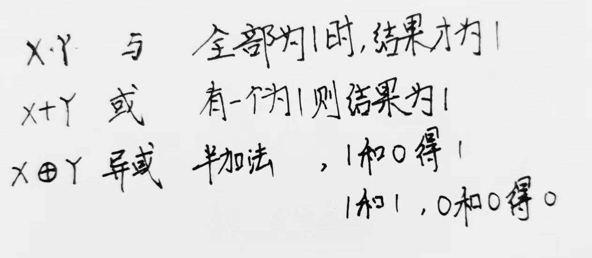
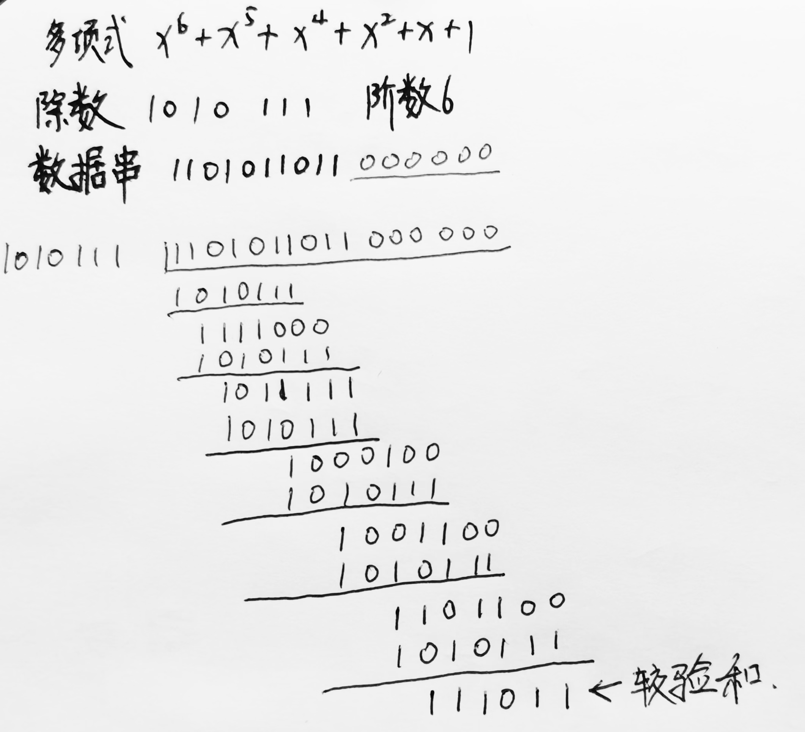
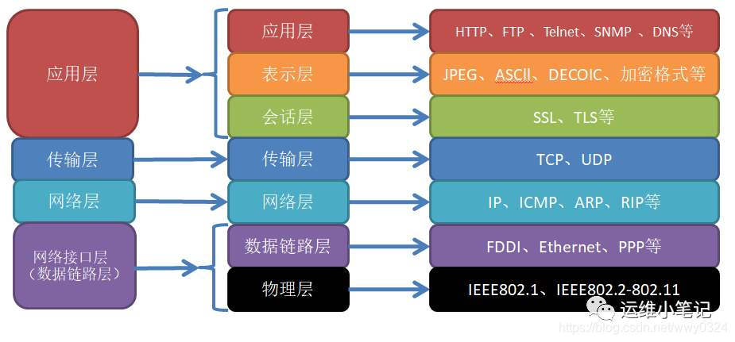
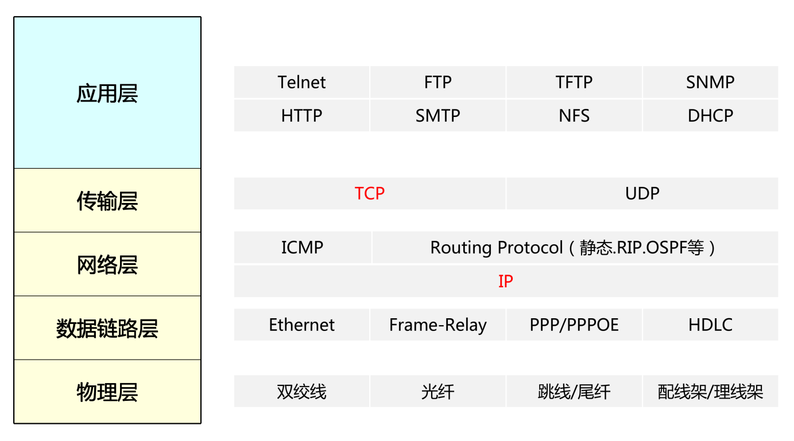

​	准备一手软考，先新建文件夹

​	预祝顺利通过！

<!-- more -->

> - Created by Typora
> - Author: LRay-iu
> - createTime: 2024-08-10 21:16
> - updateTime: 2024-08-10 21:16

## 网络基础理论

### 逻辑运算

### CRC冗余校验标准

教程来自【[CRC校验]手算与直观演示】 https://www.bilibili.com/video/BV1V4411Z7VA

1. 先用给出的CRC多项式，写出CRC除数
2. 在需要添加校验数的数据串后加0（阶数个0）
3. 用上一条加工过的数据串和CRC除数做异或运算，直至无法进行异或运算，由此得到CRC校验和
4. 将校验和添加值数据串后，得到带CRC校验的数据

**作用是对传输的数据包进行校验，而且只会校验不会纠错**

补充说明，来自[CRC校验原理及步骤-CSDN博客](https://blog.csdn.net/d_leo/article/details/73572373)

> **CRC校验原理：**
>
> 其根本思想就是先在要发送的帧后面附加一个数（这个就是用来校验的校验码，但要注意，这里的数也是二进制序列的，下同），生成一个新帧发送给接收端。当然，这个附加的数不是随意的，它要使所生成的新帧能与发送端和接收端共同选定的某个特定数整除（注意，这里不是直接采用二进制除法，而是采用一种称之为“ **模2除法**”）。到达接收端后，再把接收到的新帧除以（同样采用“ **模2除法**”）这个选定的除数。因为在发送端发送数据帧之前就已通过附加一个数，做了“去余”处理（也就已经能整除了），所以结果应该是没有余数。如果有余数，则表明该帧在传输过程中出现了差错。
>
> CRC校验中有两个关键点，一是预先确定一个发送送端和接收端都用来作为除数的二进制比特串（或多项式），可以随机选择，也可以使用国际标准，但是最高位和最低位必须为1；二是把原始帧与上面计算出的除数进行模2除法运算，计算出CRC码。

### TCP/IP  &&  OSI模型

***1. 应用层***：这是最顶层，直接与应用程序交互，定义了应用程序如何通过网络[发送数据](https://so.csdn.net/so/search?q=发送数据&spm=1001.2101.3001.7020)。常见的应用层协议有HTTP、FTP、SMTP、DNS等，它们分别负责网页浏览、文件传输、电子邮件以及域名解析等功能。

***2. 运输层***：提供端到端的数据传输服务，主要关注确保数据包能够正确、可靠地到达目的地。这一层最重要的两个协议是TCP（传输控制协议）和UDP（用户数据报协议）。TCP提供面向连接的、可靠的服务，通过序列号、确认机制和重传机制保证数据完整性；而UDP则提供无连接的、不可靠但速度快的服务。

***3. 网络层***：主要负责主机到主机之间的通信，即数据包从源网络传输到目的网络的过程。IP（互联网协议）是这一层的核心协议，它给每个数据包加上源和目的地址（即IP地址），并通过路由器进行路径选择。

***4. 网络接口层***（包括数据链路层和物理层）：负责封装成帧、错误检测、访问媒介以及物理寻址。例如，以太网协议（Ethernet）就属于这一层，它提供MAC（Media Access Control）地址，并处理数据在网络中的实际传输。

#### 各层协议

#### TCP链接

### 网络安全技术IDS

### 单播地址/组播地址

### DHCP & SMTP & SNMP & ARP等协议

### 辅助域名服务器 & 转发域名服务器

### Kerberos

### GANTT图 & PERT图

