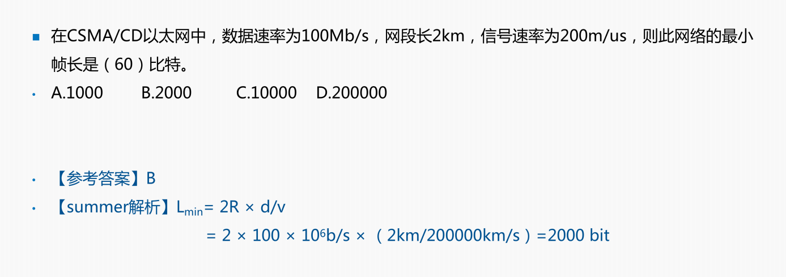
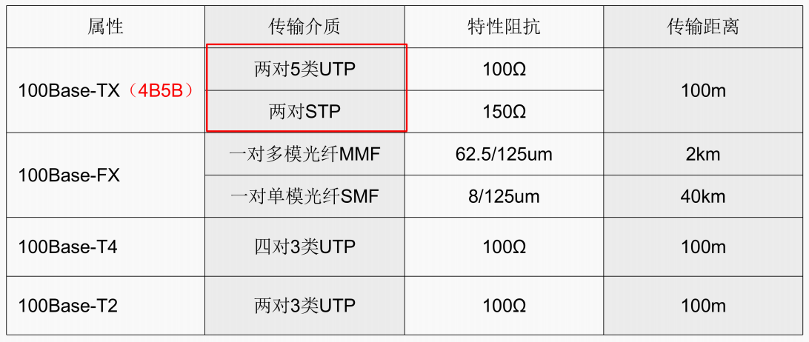
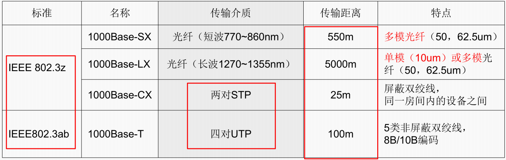
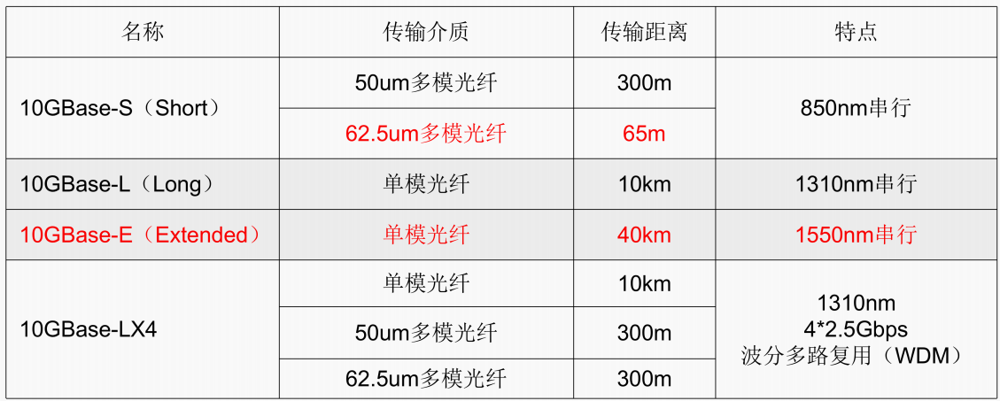
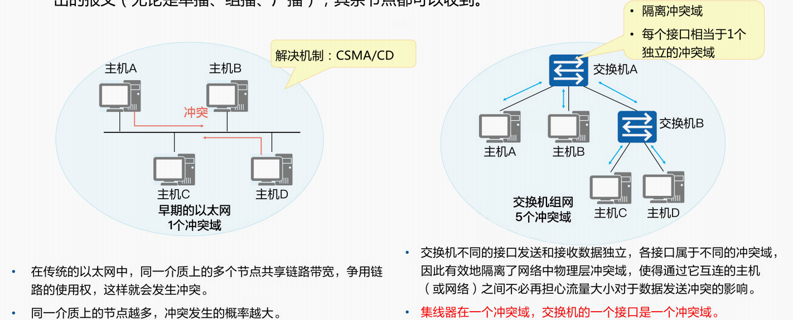
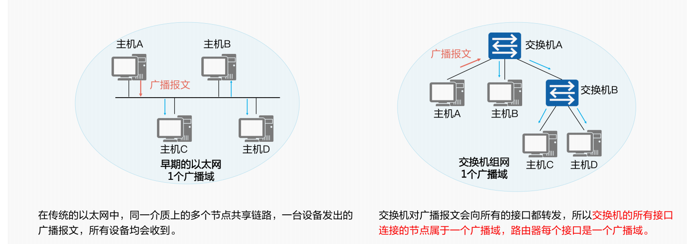

## 工具包

本笔记大部分内容来源于 **SUMMER课堂** 的课件 【淘宝买的】 【好像是盗版？就10来块钱，如果是盗版的话真是抱歉啊】

## 计算机网络概论

> 这个不难，内容也不多，直接看pdf得了

### 逻辑运算

$$
X\cdot Y\quad与运算\quad全部为1时，结果才为1
$$

$$
X+Y\quad或运算\quad有一个为1,则结果为1
$$

$$
X \oplus Y \text { } 异或 \text { } 或者说半加法，\text { }1和0得1，\text { }1和1得0，\text { }0和0得0
$$

### TCP/IP  &&  OSI模型

***1. 应用层***：这是最顶层，直接与应用程序交互，定义了应用程序如何通过网络[发送数据](https://so.csdn.net/so/search?q=发送数据&spm=1001.2101.3001.7020)。常见的应用层协议有HTTP、FTP、SMTP、DNS等，它们分别负责网页浏览、文件传输、电子邮件以及域名解析等功能。

***2. 运输层***：提供端到端的数据传输服务，主要关注确保数据包能够正确、可靠地到达目的地。这一层最重要的两个协议是TCP（传输控制协议）和UDP（用户数据报协议）。TCP提供面向连接的、可靠的服务，通过序列号、确认机制和重传机制保证数据完整性；而UDP则提供无连接的、不可靠但速度快的服务。

***3. 网络层***：主要负责主机到主机之间的通信，即数据包从源网络传输到目的网络的过程。IP（互联网协议）是这一层的核心协议，它给每个数据包加上源和目的地址（即IP地址），并通过路由器进行路径选择。

***4. 网络接口层***（包括数据链路层和物理层）：负责封装成帧、错误检测、访问媒介以及物理寻址。例如，以太网协议（Ethernet）就属于这一层，它提供MAC（Media Access Control）地址，并处理数据在网络中的实际传输。

#### 各层协议

TCP链接

网络安全技术IDS

单播地址/组播地址

DHCP & SMTP & SNMP & ARP等协议

辅助域名服务器 & 转发域名服务器

Kerberos

GANTT图 & PERT图

## 数据通信基础

> 这个感觉真挺难的。。时间不充裕的话还是先跳过吧

- 信道带宽W
- 模拟信道：f2和f1分别表示最高/最低频率，单位赫兹Hz

$$
W=f_{2}-f_{1}
$$

- 数字信道：数字信道是离散信道，带宽为信道能够达到的最大数据传输效率，单位是bit/s

- 码元：一个数字脉冲称为一个码元（可以理解为时钟周期的信号）

- 码元速率：单位时间内传送的码元个数。如果码元宽度（脉冲周期）为T，则码元速率（波特率）为`B=1/T`，单位是**波特**

- 一个码元携带的信息量n（位）与码元种类数（N）的关系为

$$
\mathrm{n}=\log _{2} N
$$

### 奈奎斯特定理

在没有噪声干扰的信道（理想）中，若信号带宽为W，则最大码元速率为**B=2W（Baud）**

极限数据速率为
$$
\mathrm{R} =\text{B} \log_{2} \mathrm{N} = 2 \mathrm{W} \log_{2} \mathrm{N}
$$

- 码元速率：每秒发送的包裹个数
- 数据速率：每秒发送的包裹重量

### 香农定理

在一个噪声信道的极限数据速率和带宽之间的关系

极限速率公式为：
$$
\mathrm{C}=\mathrm{Wlog}_{2}(1+\mathrm{S} / \mathrm{N})
$$
其中，W为信道带宽，S为信号平均功率，N为噪声平均功率，S/N为信噪比

分贝与信噪比的关系：
$$
\mathrm{dB}=10 \log _{10} \mathrm{~S} / \mathrm{N}
$$
一般来说，题目可能不会直接给 **S/N** ，

- **dB=10** ==> **S/N=10**
- **dB=30** ==> **S/N=30**

### CRC冗余校验标准

教程来自【[CRC校验]手算与直观演示】 https://www.bilibili.com/video/BV1V4411Z7VA

1. 先用给出的CRC多项式，写出CRC除数
2. 在需要添加校验数的数据串后加0（阶数个0）
3. 用上一条加工过的数据串和CRC除数做异或运算，直至无法进行异或运算，由此得到CRC校验和
4. 将校验和添加值数据串后，得到带CRC校验的数据

**作用是对传输的数据包进行校验，而且只会校验不会纠错**

补充说明，来自[CRC校验原理及步骤-CSDN博客](https://blog.csdn.net/d_leo/article/details/73572373)

> **CRC校验原理：**
>
> 其根本思想就是先在要发送的帧后面附加一个数（这个就是用来校验的校验码，但要注意，这里的数也是二进制序列的，下同），生成一个新帧发送给接收端。当然，这个附加的数不是随意的，它要使所生成的新帧能与发送端和接收端共同选定的某个特定数整除（注意，这里不是直接采用二进制除法，而是采用一种称之为“ **模2除法**”）。到达接收端后，再把接收到的新帧除以（同样采用“ **模2除法**”）这个选定的除数。因为在发送端发送数据帧之前就已通过附加一个数，做了“去余”处理（也就已经能整除了），所以结果应该是没有余数。如果有余数，则表明该帧在传输过程中出现了差错。
>
> CRC校验中有两个关键点，一是预先确定一个发送送端和接收端都用来作为除数的二进制比特串（或多项式），可以随机选择，也可以使用国际标准，但是最高位和最低位必须为1；二是把原始帧与上面计算出的除数进行模2除法运算，计算出CRC码。

## 广域通信网

### 广域网物理层特性

- 3G：基于时分复用，传语音，顺便传数据
- 4G：基于分组交换，传数据，顺便传语音

- RS-232-C 采用V.28标准电路，**速率20kb/s**，**最长15米**，信号源产生3-15V的信号，±3V是信号电平过渡区域，串口，**9针或25针**

 

### 流量与差错控制

#### 流量控制

**停等协议**

发一次，确认一次

**滑动窗口协议**

发送几帧（缓冲区帧数），确认一次

#### 差错控制

**停等ARQ协议**

发一帧必须等待下一帧，一定时间没有收到，超时重传

**选择重发ARQ协议**

重传特定的某一帧
$$
W_{\text {发 }}=W_{\text {收 }} \leq 2^{k-1}
$$
**后退N帧ARQ**

后退几帧，并且将之后的所有帧都重新发送
$$
W_{\text {发 }}=W_{\text {收 }} \leq 2^{k}-1
$$

> **记忆方法**：
>
> 选上退下(-1的位置)

### 帧中继与HDLC

#### 帧中继FR

【**老技术，基本上被淘汰了**】

- 帧中继在**第二层**（链路层）建立虚电路，提供**虚电路服务**，本地标识DLCI。
- 基于分组交换的透明传输，可提供**面向连接**的服务。
- **只做检错和拥塞控制，没有流量和重传机制，开销很小。**
- 既可以按需求提供带宽，也可以应对突发的数据传输。CIR：承诺速率	EIR：扩展速率
- 帧长可变，长度可达1600-4096字节，可以承载各种局域网的数据帧
- 可以达到很高的速率，2-45Mbps

- 不适合对延迟敏感的应用（语音、视频）
- 数据的丢失依赖于运营商对虚电路的配置
- 不保障可靠的提交

#### ISDN和ATM

##### 窄带ISDN

- 基本速率（小型企业和家庭使用）BRI=2B+D=**144kbps**
- 基群速率（大型企业）PRI=30B+D=**2.048M=2048kb/s**

##### 宽带ISDN（即ATM）

- ATM是信元交换，信元为**53字节**的固定长度
- ATM依然是虚电路提供面向连接的服务
- ATM典型速率为**150M**

#### HDLC（高级链路控制协议）

HDLC是一种**面向位（比特）的同步**链路控制协议

通常使用CRC-16、CRC-32进行校验，帧边界**“01111110”**

| 标志：1字节（8位） | 1字节 |  1字节   | >=0字节 | 2字节 | 标志：1字节 |
| :----------------: | :---: | :------: | :-----: | :---: | :---------: |
|      01111110      | 地址  | 控制字段 |  DATA   |  FCS  |  01111110   |

其中，控制字段分为**信息帧**、**监控帧**、**无编号帧**【同一个HDLC帧中只能有一种控制字段】

| I帧：信息帧       | **0** | **N(S)** | **P/F** | **N(R)** |
| ----------------- | ----- | ----- | ------- | -------- |
| 比特序号 | 1 | 234 | 5 | 678 |

**信息帧（I帧**）：第一位为0，用于承载**数据**与**控制**

N(S)标识发送帧序号，N(R)表示下一个预期要接收帧的序号，N(R)=5表示下一帧要接收5号帧；N(S)和N(R)均为**3位二进制编码**，可取值0~7

| **S帧：监控帧** | **1** | **0** | **S** | **P/F** | **N(R)** |
| --------------- | ----- | ----- | ----- | ------- | -------- |
| 比特序号        | 1     | 2     | 34    | 5       | 678      |

监控帧（S帧）：前两位为10，监控帧用于差错控制和流量控制

S帧控制字段的第三、四位为S帧类型编码，共有四种不同编码，含义如下方所示

| 记忆符 | 名称         | S字段 | S字段 | 功能                                           |
| ------ | ------------ | ----- | ----- | ---------------------------------------------- |
| RR     | 接收准备好   | 0     | 0     | 确认，且准备接受下一帧，已收妥N(R)以前的各帧   |
| RNR    | 接收未准备好 | 1     | 0     | 确认，暂停接受下一帧，N(R)含义同上             |
| REJ    | 拒绝接收     | 0     | 1     | 否认，否认N(R)起的各帧，但N(R)以前的各帧已收妥 |
| SREJ   | 选择拒绝接收 | 1     | 1     | 否认，只否认序号为N(R)的帧                     |

| **U帧：无编号帧** | **1** | **1** | **M** | **P/F** | **M** |
| ----------------- | ----- | ----- | ----- | ------- | ----- |
| 比特序号          | 1     | 2     | 34    | 5       | 678   |

无编号帧（U帧）：控制字段种不包含编号N(S)和N(R)，U帧用于提供对链路的**建议**，**拆除**以及**多种控制功能**，但是当要求提供不可靠的无连接服务时，他有时可以**承载数据**。

## 局域网和城域网

IEEE定义链路层的协议

> 大多已经淘汰了，还在广泛使用的有802.3(CSMA/CD)

### CSMA/CD

对总线型、星型和树型拓扑访问控制协议是**CSMA/CD**(载波侦听多路访问/冲突检测)

基本原理：发送数据前，先监听信道上是否有人在发送。
		有，说明信道忙，无，说明信道空闲，之后**根据策略控制**发送

- if（闲）{是否发送？}
- if（忙）{是否继续监听？}

如果连续发生**16**次碰撞，说明**网络繁忙或是故障**，不再尝试发送。

#### CSMA三种监听算法

将监听比作尿急时去看厕所有没有人上厕所

**【1】非坚持型监听算法：后退随机时间**

厕所有人上厕所，我过个10分钟看看还有没有人上厕所

特点：降低冲突概率，但是**利用率低**，快给尿憋死了

**【2】1-坚持型监听算法：继续监听，不等待**

我不出去了，我时刻看对方上没上完厕所

特点：**冲突率**和**利用率**都很高，单位时间里始终会发现有人在上厕所

**【3】p-坚持型监听算法**

如果厕所没人，已概率P去上厕所，以概率（1-P）延迟一个时间单元来上厕所，P大小可以调整。

特点：结合上述两种算法

#### 冲突检测原理

载波监听只能**减少冲突概率，不能完全避免冲突**

简而言之就是在发送的同时监听自己发送的是否有重复的数据，边发边听边检测

一旦发现有重复的数据，说明**发生了冲突，立即停止**发送并且发送一个**简短的干扰信号（Jamming）**，是所有站都停止发送

发送Jamming信号后，**等待随机长的一段时间**，重新监听，再试着发送。

### 二进制指数退避算法

#### 工作原理

一旦检测到冲突，马上停止发送数据 ，并等待随机时间再发送数据；连续碰撞16次后认为网络繁忙，不再尝试发送
$$
\text { 随机时间 }=\tau^{*} \text { Random }\left[0,1 ， \ldots 2^{k}-1\right]
$$
其中**k=min[重传次数，10]**

> ***重传3次后立刻发送的概率？***
>
> 1/8，立刻发送=>随机时间为0
>
> ***两个站点连续重传三次后再次冲突概率？***
>
> 即第四次重传，得出的随机时间依旧是相同的。各有八种选择，同时选到一样的概率是1/8

**只能减少！不能杜绝！发生冲突也有可能是链路故障！**

### 最小帧长计算

最小帧长计算公式：
$$
\operatorname{L_{min}}=2 R \times d / v
$$
首先要注意单位换算  **bit （位） B（字节） word  （ 字）   1 字 =2字节=16位** 

R为网络数据速率，d为最大距离，v为传播速度

不冲突的条件：**发送时间 >= 传送时间+确认时间**

> **帧未检测到冲突的情况：** 如果发送帧的时间（即帧的长度）小于信道传输时延的两倍，站点A可能已经发送完数据，但还没有检测到冲突信号。而如果站点B在发送的过程中发生冲突，站点A由于已经发送完成，可能不会知道冲突的发生，认为数据成功发送。这样就会出现数据丢失或无法正常传输的情况。

$$
\mathrm{L} / \mathrm{R} \geq 2 \times \mathrm{d} / \mathrm{v}
$$

例题：

### 以太网帧结构和物理层标准

当今网络基础，以太网和ip组成现在的互联网

#### 以太网帧结构

**IEEE 802.3 帧格式↓**

| 7        | 1          | 6        | 6      | 2    | 46-1500 | 4      |
| -------- | ---------- | -------- | ------ | ---- | ------- | ------ |
| 先导字段 | 帧开始标识 | 目的地址 | 源地址 | 长度 | 数据    | 校验和 |
| 10101010 | 10101011   |          |        |      |         |        |

前面7+1字节用于时钟同步，不算入帧长

数据46-1500字节，不够也要填充到46字节

校验位4字节，CRC冗余校验32位

最小帧长6+6+2+45+4

最大帧长6+6+2+1500+4

又可以分为

| 以太网报头    | IP报头 | TCP报头 | 应用数据 | 以太网尾部 |
| ------------- | ------ | ------- | -------- | ---------- |
| 6+6+2（字节） | 20     | 20      | 6-1460   | 4          |

**TCP报头＋应用数据 =>TCP段**

**IP报头+TCP报头＋应用数据 => IP数据包**

#### 命名规范

> 100BASET：100Mbps /基带传输 /最大传输距离
>
> T表示双线线，F表示光纤，如果有5表示500米

#### 快速以太网802.3u（100M）

UTP是非屏蔽双绞线，STP是屏蔽双绞线

#### 千兆以太网

两个标准**802.3z**和**802.3ab**（1000BASE-T），千兆需要**四对双绞线**，达到**100米传输**

#### 万兆以太网802.3ae(10G)

### VLAN基础

虚拟局域网（Virtual Loacal Area Network）

不同VLAN通信必须经过三层设备：**路由器**，三层交换机，防火墙

虚拟局域网工作站可以不属于用一个物理网段，属于同一VLAN的所有端口构成一个广播域

**一个中继器和集线器属于一个冲突域，交换机的一个接口为一个冲突域，一个VLAN为一个广播域。**

##### 冲突域

连接在同一共享介质上的所有节点的集合，**冲突域内所有节点竞争同一带宽**，无论单薄，组播，广播，其余节点都能收到。

但是交换机解决了多个用户发送报文冲突的问题，每一个交换机与互联的主机都是独立的冲突域。

##### 广播域

广播报文能到达的整个访问范围称为二层广播域，简称广播域，同一广播域内的主机都能收到广播报文。

**交换机所连接的所有接口属于一个广播域**

**路由器的每一个接口都是一个广播域**
