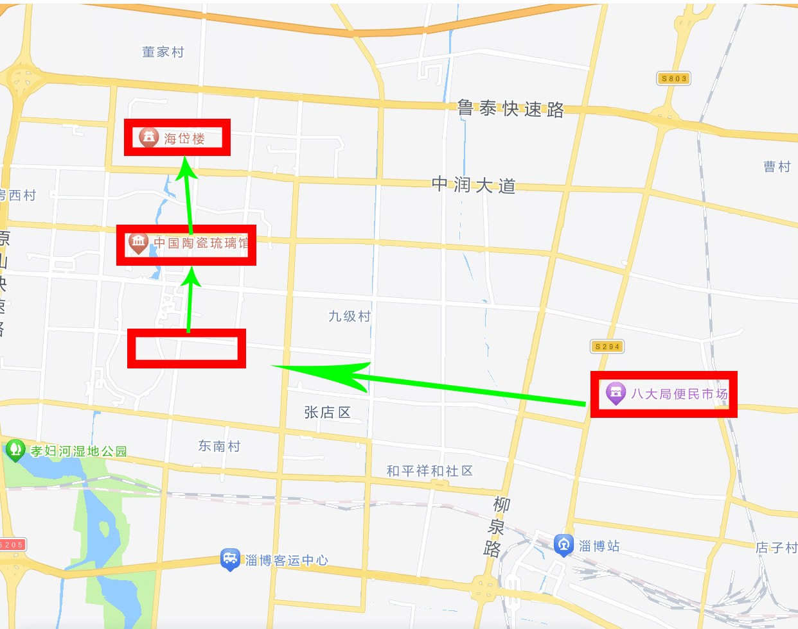

​	2024年6月23日，在淄博市停留了一天时间游玩。

<!-- more -->

> * Created by Typora
> * Author: LRay-iu
> * createTime: 2024-07-15 10:48
> * updateTime: 2024-07-15 10:48

## 行程记录

```txt
6月23日：晴
08：40 骑电瓶车前往八大局便民市场
11：30 骑共享电动车前往齐风塔
12：15 打车前取吃午饭
14：00 骑共享电瓶车前往中国琉璃博物馆
17：00 骑电瓶车前往海岱楼
18：20 搓顿烧烤
19：05 骑车返回酒店拿行李
19：46 打车前往淄博站
20：15 乘坐班次G454前往泰安站
```

## 出行路线



## 八大局便民市场


早上一大早骑车过来的
